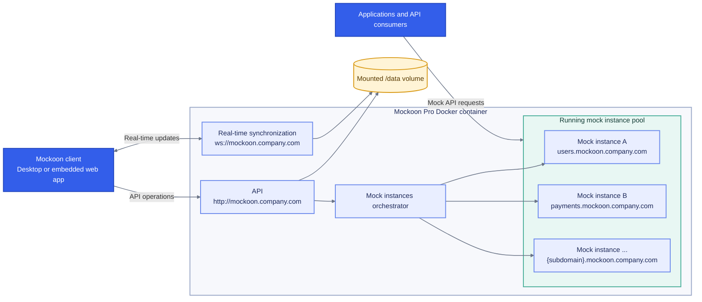

# Discover Mockoon Pro

---

> 💡 If you are looking for the multi-tenant cloud version of the documentation, please refer to the legacy [Mockoon Cloud documentation](/cloud/docs/about/).

**Mockoon Pro** brings collaboration directly into your own private infrastructure, sovereign cloud, on-premises servers, or air-gapped network.

It packages everything required to run a full-featured, team-wide mock API platform in a single lightweight service: **real-time data synchronization**, **mock API hosting and orchestration**, an **embedded web application**, an **administration dashboard**, and enterprise **single sign-on (SSO)**.

## Core capabilities

- **[Collaboration](pro-docs:features/data-synchronization-team-collaboration)**: Work together with your team in real time, with presence indicators and conflict resolution.
- **[Mock deployments](pro-docs:features/api-mock-deployments)**: Deploy running mock servers directly on your internal network with automatic subdomain routing.
- **[Web app](pro-docs:clients/embedded-web-application)**: Access and edit your mock APIs directly in your browser without installing the desktop application.
- **[Authentication and users management](pro-docs:misc/authentication)**: Support for local accounts, member invitations, and OpenID Connect (OIDC) Single Sign-On.
- **[Audit trail](pro-docs:misc/audit-trail)**: Track administrative, security, and workspace events.

## Self-hosting or managed cloud

Mockoon Pro can be deployed either on your **own private infrastructure (self-hosted)** or as a **managed cloud service** provided by Mockoon. The self-hosted option gives you full control over your data and network environment, while the managed cloud option offers convenience and reduced operational overhead.

[Contact us](/contact-form/) for more information about the managed cloud option or visit our [pricing page](/pricing/).

## Architecture

Mockoon Pro runs as a **lightweight Docker container with zero external database dependencies**. All state and mock environment data are stored in the mounted `/data` directory.

The desktop or embedded web client connects to the base domain (for example, `mockoon.company.com`) for API operations and real-time synchronization. The orchestrator starts and manages a pool of mock API instances exposed on wildcard subdomains such as `users.mockoon.company.com` and `payments.mockoon.company.com`. Application state, users, settings, and mock data persist in the mounted `/data` volume.

Mockoon Pro is built for **private and isolated networks**. License validation is 100% offline with zero phoning home, no outbound internet access is required, and no telemetry or analytics are collected. All mock definitions, user accounts, and credentials remain entirely on your own infrastructure.

> 💡 Outbound access is still required for certain Mockoon features, like [callbacks](docs:callbacks/overview) or [proxying requests](docs:server-configuration/proxy-mode) to external APIs.

## Application release compatibility

Mockoon Pro is compatible starting from Mockoon [Desktop version 9.9.0](/releases/9.9.0/). Versioning of Mockoon Pro is aligned with the Desktop application, ensuring compatibility between the two.

The [embedded web application](pro-docs:clients/embedded-web-application) is always compatible with the corresponding version of Mockoon Pro, ensuring a seamless experience for your team.

## Getting started

1. Deploy the container using the **[Installation guide](pro-docs:self-hosting/installation)**.
2. Complete the initial configuration using the **[Setup guide](pro-docs:self-hosting/initial-setup)**.
3. Invite your team members or configure **[Authentication](pro-docs:misc/authentication)**.
4. Access the **[embedded web app](pro-docs:clients/embedded-web-application)** or connect the **[Desktop app](pro-docs:clients/desktop-application)**.
